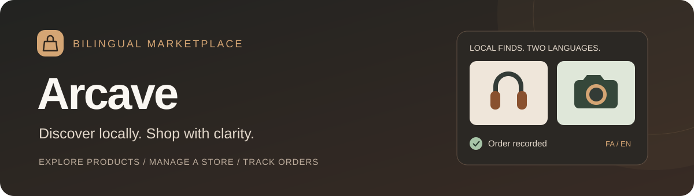
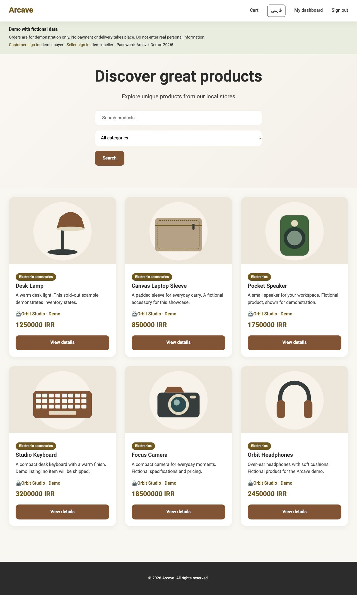
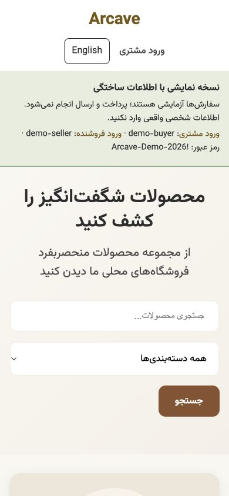
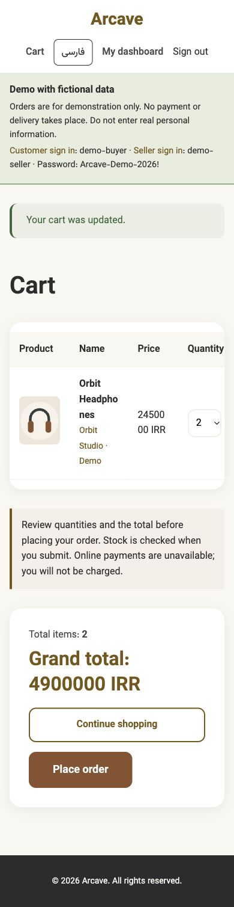
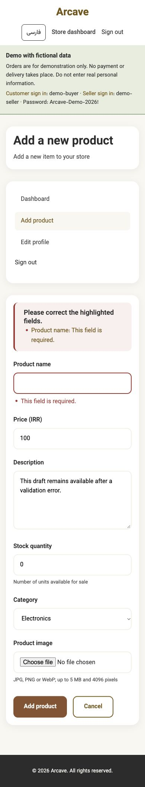

<p align="center">
  
</p>

<p align="center">
  <a href="https://github.com/Arad-d/arcave-marketplace/actions/workflows/tests.yml"></a>
  
  
  
</p>

<p align="center">
  A marketplace that connects customers with independent stores.<br>
  Discover products, manage inventory, and keep a clear record of every order.
</p>

<p align="center">
  <a href="#a-look-inside"><strong>Explore the screenshots</strong></a> ·
  <a href="#get-started">Run locally</a> ·
  <a href="USER_EXPERIENCE.md#fictional-demo">Demo setup</a> ·
  <a href="docs/portfolio/README.md">Case study</a> ·
  <a href="SECURITY.md">Security</a>
</p>

## From a local discovery to a recorded order

Arcave brings customer and seller journeys into one Django application. Browse a store's products, build a cart, and review an order. Sellers manage listings and inventory, see their sales, and reply to buyer reviews.

**Explore the catalog before signing in.** Customer accounts are required for cart changes and purchases. Persian and English interfaces switch between RTL and LTR layouts, while prices stay in Iranian rials (IRR).

The fictional demo includes six products, sample accounts, an order and a buyer review. It runs in a separate local database. **A public hosted demo is not available yet; no payments or deliveries take place.**

## A look inside

<details>
  <summary><strong>Desktop catalog — expand to view</strong></summary>
  <p></p>
</details>

<table>
  <tr><th>Browse in Persian</th><th>Review your cart</th><th>Recover from a form error</th></tr>
  <tr>
    <td valign="top"></td>
    <td valign="top"></td>
    <td valign="top"></td>
  </tr>
</table>

All screenshots use fictional accounts and products. [View the order receipt and full case study](docs/portfolio/README.md).

## What you can do

| | In Arcave |
| --- | --- |
| **Discover products** | Browse without signing in, search listings, filter categories, and explore store profiles and product details. |
| **Review before ordering** | Adjust cart quantities explicitly, check the total, and record an order with a unique receipt number. Stock is checked again at checkout. |
| **Run a store** | Create and edit listings, upload validated product images, manage inventory, and view store-specific sales. |
| **Keep purchase history** | Receipts preserve the purchased name, store, quantity and price even after a listing changes or is deleted. |
| **Talk about a purchase** | Customers can review products they purchased; the seller can reply. Duplicate replies preserve the original answer. |
| **Choose your language** | Switch between Persian and English from the header, with responsive RTL/LTR layouts and a saved language preference. |

## Get started

Use Python **3.10–3.14**, PostgreSQL **17**, and a local database configured for this project.

```sh
git clone https://github.com/Arad-d/arcave-marketplace.git
cd arcave-marketplace/django_project
python3 -m venv .venv
source .venv/bin/activate
python -m pip install -r requirements-dev.txt
cp .env.example .env
```

Follow [SETUP.md](SETUP.md) to generate a private secret, configure your database and apply migrations. Preserve an existing `.env` if you already have a local installation. Then run:

```sh
python manage.py migrate
python manage.py runserver
```

Open [localhost:8000](http://127.0.0.1:8000/). Windows activation and a macOS/Linux setup helper are covered in the guide.

**Try this:** follow the [fictional demo setup](USER_EXPERIENCE.md#fictional-demo), sign in as the sample customer, add headphones to the cart, change the quantity, and place a demonstration order. Open the receipt, then use the sample seller account to explore inventory and reviews.

## Under the hood

- **Django / Python:** server-rendered pages with separate customer and seller dashboards.
- **PostgreSQL transactions:** checkout locks the customer and product rows, then records the order, deducts stock and clears the purchased cart together.
- **Protected confirmations:** signed, customer-specific tokens prevent duplicate orders and require another cart review when quantities or prices change.
- **Durable receipts:** order lines snapshot the purchased details; deleted listings do not erase purchase history.
- **Account and upload protection:** hashed credentials, server-side ownership checks, CSRF protection, recovery limits, and decoded/re-encoded raster uploads.
- **Bilingual presentation:** Django translation catalogs, a persistent language switch, accessible form errors and responsive layouts.

Read the [checkout design and tradeoffs](SHOPPING.md), [security improvements](SECURITY.md), and [UX verification notes](USER_EXPERIENCE.md).

## Quality checks

```sh
cd django_project
python manage.py check
python manage.py makemigrations --check --dry-run
python manage.py test accounts shop arcave --settings=arcave.test_settings
```

The [GitHub workflow](.github/workflows/tests.yml) runs configuration and migration checks, dependency checks, translation validation, and the PostgreSQL test suite on Python **3.10 and 3.14**. Action versions are pinned to commit hashes; test jobs have read-only repository permissions.

Tests cover account security, seller permissions, cart updates, competing purchases, duplicate checkout, receipt snapshots, translation, form errors and isolated demo setup. See [MAINTENANCE.md](MAINTENANCE.md) for test database requirements, coverage and troubleshooting.

## Project map

| Path | Purpose |
| --- | --- |
| [`django_project/accounts/`](django_project/accounts/) | Customer and seller authentication, profiles and recovery. |
| [`django_project/shop/`](django_project/shop/) | Listings, carts, checkout, orders and reviews. |
| [`django_project/arcave/`](django_project/arcave/) | Configuration, error pages, logging and demo isolation. |
| [`docs/portfolio/`](docs/portfolio/) | Fictional-data screenshots and project case study. |
| [`main.py`](main.py) | Original SQLite terminal prototype, retained to show the project's evolution. |

## Current capabilities

Arcave is a portfolio prototype. Checkout records orders and updates inventory; it does not collect payment. Shipping, cancellations, refunds and payment reconciliation are not implemented. Product descriptions and reviews remain in the language their authors entered.

Public hosting, operational monitoring and a tested backup/recovery process still need configuration. Shared demo accounts can modify their fictional data. Read [SECURITY.md](SECURITY.md) before deploying or accepting real customer information. The historical terminal prototype is not the active website.

## Author

Created and maintained by **[Arad Delbari](https://github.com/Arad-d)**.
