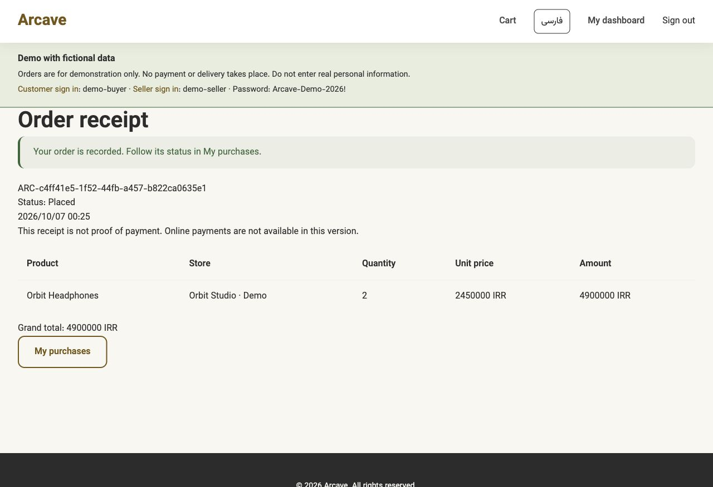

# Arcave — bilingual marketplace

A Django marketplace for customers and independent sellers, with Persian and English interfaces. Customers browse products, manage a cart and receive an order record. Sellers manage listings, inventory and buyer reviews.

[View the source on GitHub](https://github.com/Arad-d/arcave-marketplace)

**Stack:** Python · Django · PostgreSQL · HTML/CSS · GitHub Actions

## From prototype to a stronger application

Arcave started as a Python and SQLite terminal application. The website extends that idea into separate customer and seller journeys. The improvement work focused on the parts that make a shopping application dependable: account security, stock consistency, clear feedback and regression tests.

Passwords and recovery answers are hashed. Seller permissions are checked on the server, and uploaded images are validated and re-encoded. Checkout uses database transactions and row locks to prevent competing purchases from overselling stock. Signed confirmations prevent accidental duplicate orders and require another review if the cart or prices change. Receipt lines keep the purchased names and prices even after a listing is edited or deleted.

The interface supports Persian RTL and English LTR with a persistent language switch. Visitors can browse before registering. Mobile layouts, explicit cart updates, accessible field errors and retained form values make common shopping and seller tasks easier to complete.

Automated tests cover account protection, cart behavior, checkout failures, concurrent purchases, permissions, translations and demo setup. GitHub Actions runs the suite against PostgreSQL on Python 3.10 and 3.14.

## What this project demonstrates

- Turning a small prototype into a structured web application.
- Protecting inventory and order history with database-backed rules.
- Supporting two languages and writing directions across customer and seller flows.
- Testing failures and concurrent requests, beyond the successful purchase path.
- Presenting the application with fictional data, reproducible setup and documented limits.

## Screenshots

These screenshots show fictional products and accounts from the local demo. The illustrations are original SVG assets included in the repository.

| Persian mobile catalog | Mobile cart review |
| --- | --- |
|  |  |

[See the form-error example](form-errors-en.jpg).

## Current limits

Arcave is a portfolio prototype. Orders update inventory and create receipts, but there is no payment gateway, delivery integration, cancellation or refund flow. A public hosted demo is pending hosting setup. Operational safeguards and stronger recovery options are needed before serving real customers.

## Short portfolio card

**Arcave Marketplace** — A Persian/English Django marketplace with customer and seller dashboards, protected checkout, inventory locking and durable order receipts. Built with PostgreSQL and tested through GitHub Actions, with responsive RTL/LTR layouts and a fictional demonstration dataset.

Use the GitHub link above as the source link. Add a live-demo link only after the hosted Django deployment is verified.
